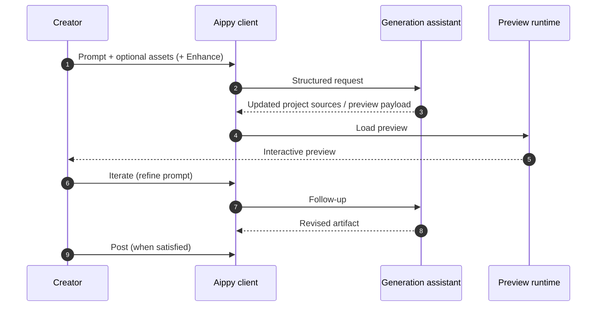
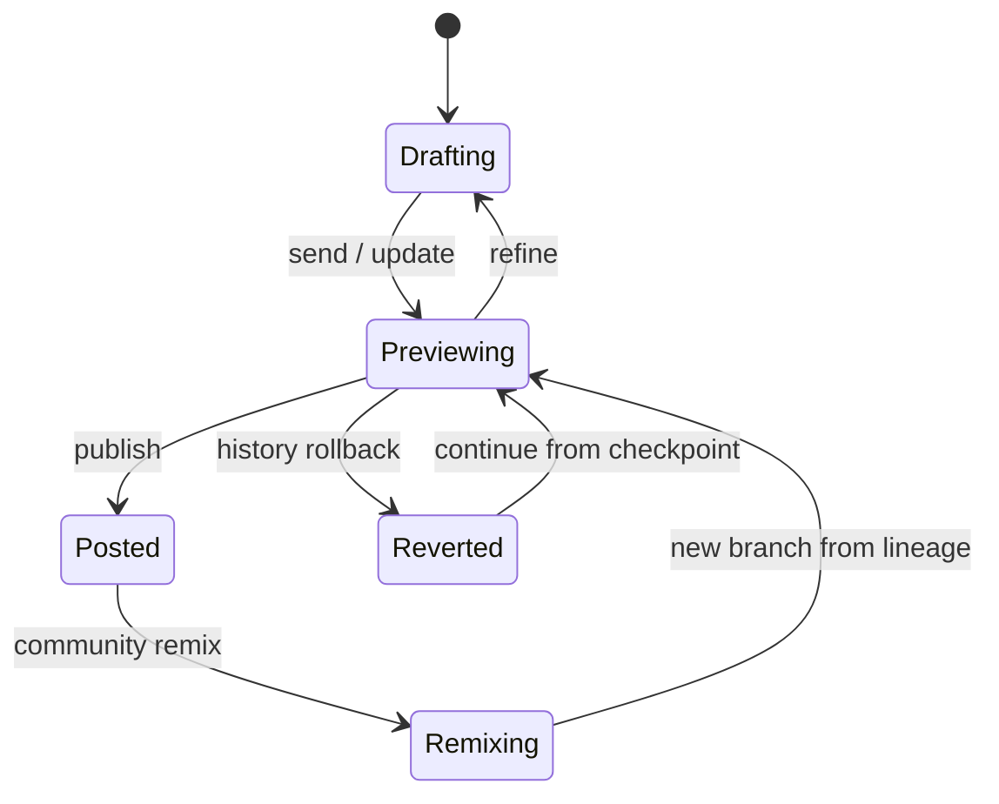
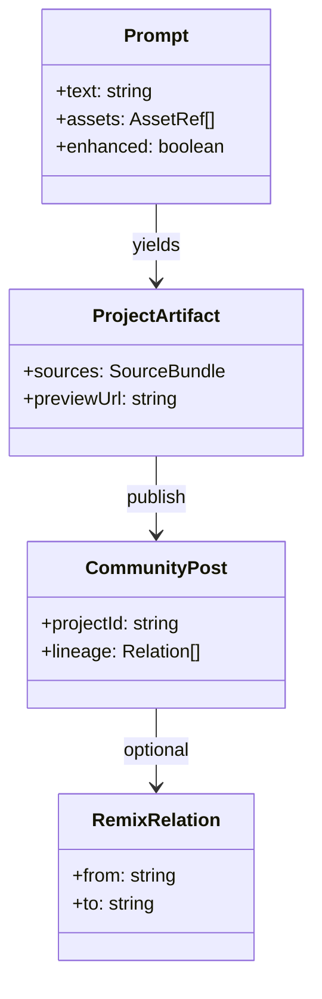

# Information flow

A sequence-style view of how **intent** turns into something **playable**. Timings are not literal; the diagram encodes **dependencies**.

## Creation pipeline (sequence)

## Pipeline illustration

## State machine (coarse)

## Data classes (documentation metaphor)

## Related

- [Creator journey](../flows/creator-journey.md)
- [Remix and revert](../flows/remix-and-revert.md)
