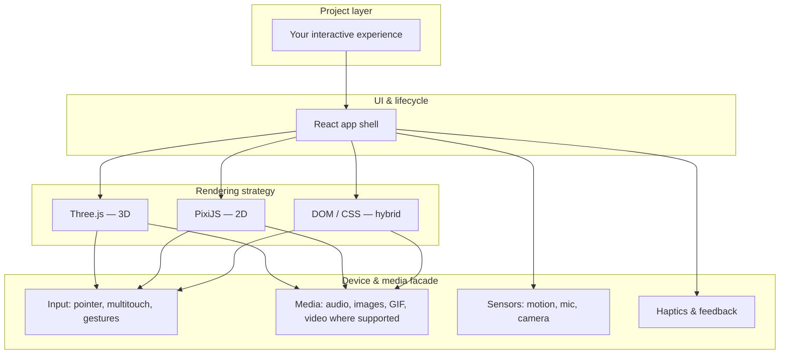

# Runtime layers

How an **interactive project** is thought to sit on top of platform capabilities. This is a **logical stack** for documentation — not a guarantee of internal module names.

## Layered view

## Capability layering (illustration)

## Decision heuristics (for creators)

| Goal | Typical direction |
|------|-------------------|
| Volumetric scenes, lighting, meshes | Favor **Three.js** patterns in prompts |
| Sprites, particles, fast 2D | Favor **PixiJS** patterns |
| Mixed UI + canvas | Describe **React** layout plus canvas islands explicitly |
| Camera / face / hand | Call out **device permissions** and fallback UX |

## Related

- [Capability matrix](../reference/capability-matrix.md)
- [Information flow](information-flow.md)
