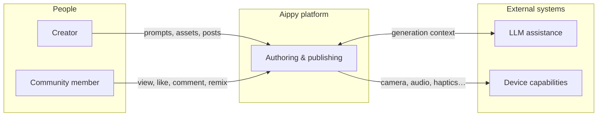

# System context

A **context-level** view: actors and the single software system they care about for creation and discovery. Boundaries are logical, not deployment-specific.

## Context diagram

## Trust boundaries

| Boundary | Inside | Outside (conceptually) |
|----------|--------|-------------------------|
| Identity & billing | Product account system | This docs repo |
| Generated project code | Project runtime bundle | Unrelated third-party backends |
| Community graph | Likes, comments, remix lineage | Not mirrored here |

## Related

- [Runtime layers](runtime-layers.md)
- [Ecosystem SVG](../../assets/diagrams/ecosystem.svg)
